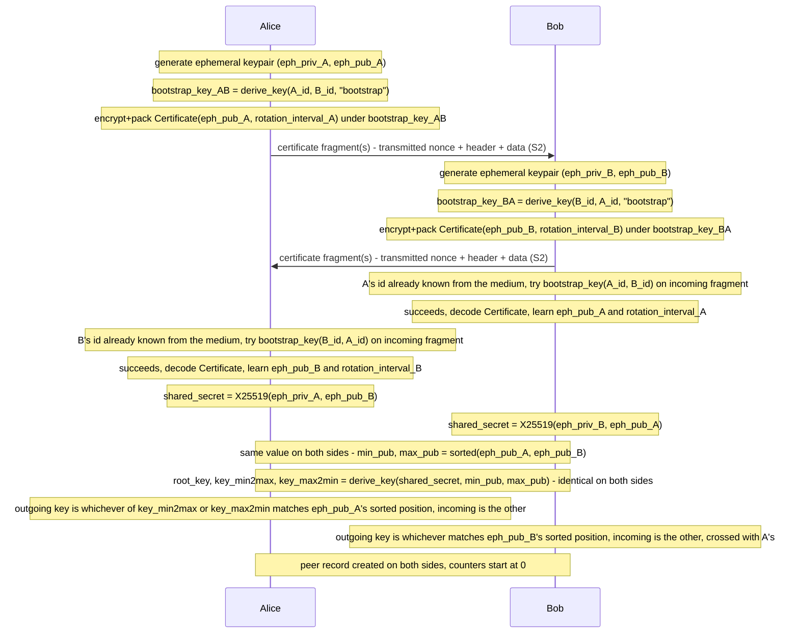
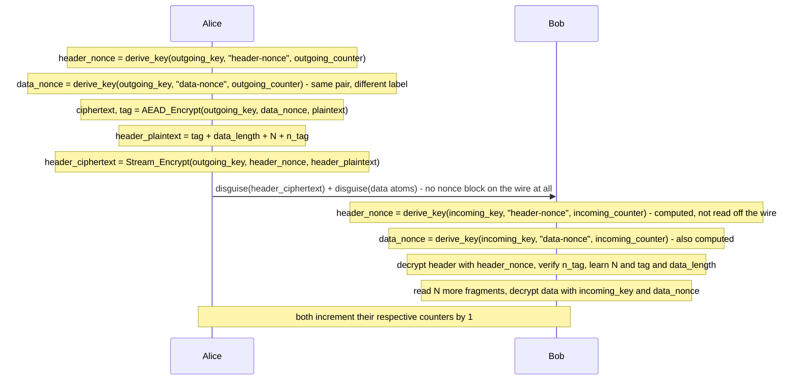
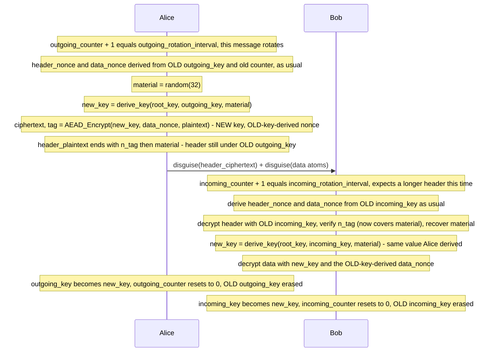

# Cryptographic summary — all message types

> Precise reference, not a tutorial. See the [protocol spec](superpowers/specs/2026-08-27-messaging-protocol-design.md)
> §4–§6 for the reasoning behind each choice; this document only states *what*, not *why*.
> `||` = byte concatenation. `derive_key(parts…, n)` = BLAKE2b over the sequential concatenation of
> `parts`, `n`-byte output (no keying, no HMAC — a plain hash, per `core/sources/crypto.py`'s
> `derive_key`). AAD is unused (empty) on every AEAD call in this protocol.

## 0. Primitives

| Primitive | Used for |
|---|---|
| X25519 | ECDH, handshake only |
| XChaCha20-Poly1305 (AEAD) | data-portion confidentiality + integrity, every message type |
| XChaCha20, no Poly1305 (stream-only) | header-portion confidentiality only, every message type |
| BLAKE2b (via `derive_key`) | every key/nonce/tag derivation below |

## 1. Handshake key material (derived once, from ECDH)

```
shared_secret          = X25519(own_ephemeral_private, peer_ephemeral_public)
min_pub, max_pub        = sorted(own_ephemeral_public, peer_ephemeral_public)   # byte-lexicographic
root_key                = derive_key(shared_secret, min_pub, max_pub, "airwire-root-key", 32)
key_min2max              = derive_key(shared_secret, min_pub, max_pub, "airwire-min2max", 32)
key_max2min              = derive_key(shared_secret, min_pub, max_pub, "airwire-max2min", 32)
```

Whichever of `key_min2max`/`key_max2min` matches *your own* pubkey's sorted position is your
outgoing key; the other is your incoming key. Both sides compute identical `root_key`,
`key_min2max`, `key_max2min` — canonical ordering means neither side needs to know who's "self" vs
"peer" to agree.

## 2. Certificate (handshake bootstrap message)

`sender_id` is not a field here — the receiver already knows it from the medium before it can even
pick which key to try decrypting with, and a successful AEAD tag already proves it was correct, so a
redundant copy in the plaintext would add nothing.

| Field | Value |
|---|---|
| Key | `bootstrap_key(sender_id, recipient_id) = derive_key(utf8(sender_id), utf8(recipient_id), "airwire-handshake-bootstrap", 32)` — public, anyone who knows both IDs can derive it (pair-specific: Alice→Bob and Alice→Charlie use different keys) |
| Plaintext | `ephemeral_public_key(32B) \|\| rotation_interval(2B BE)` — fixed 34 bytes, no framing needed |
| `header_nonce` | **fresh random, 24B, transmitted** (not derived — see §3 for why not) |
| `data_nonce` | `derive_key(bootstrap_key, "airwire-data-nonce", header_nonce, 24)` — derived from the *transmitted* nonce above, not a second independent random value; the receiver already has `header_nonce` in hand before it ever needs `data_nonce`, so there's no circularity |
| Data AEAD | `(ciphertext, tag) = XChaCha20Poly1305_Enc(bootstrap_key, data_nonce, plaintext)` |
| Header plaintext | `tag(16) \|\| data_length(4B BE) \|\| N(2B BE) \|\| n_tag(4B)` — 26 bytes |
| `n_tag` | `derive_key(subkey, data_nonce, N, "", 4)[:4]` truncated to 4B, `subkey = derive_key(bootstrap_key, "airwire-envelope-n-tag", 32)` (rotation-material input is empty here) |
| Header ciphertext | `XChaCha20_Stream(bootstrap_key, header_nonce, header_plaintext)` — no tag |
| Wire (fragment 1) | `disguise(header_nonce) \|\| disguise(header_ciphertext) \|\| disguise(data atoms…)` |
| Wire (fragments 2..N) | `disguise(data atoms…)`, continued |

## 3. Data message, no rotation this message

| Field | Value |
|---|---|
| Key | current outgoing directional key (`key_min2max` or `key_max2min`, whichever is yours) |
| `message_counter` | per-direction, starts at 0 on key establishment, +1 after every message sent on this key, reset to 0 only on rotation (§4) |
| `header_nonce` | `derive_key(directional_key, "airwire-header-nonce", message_counter as 4B BE, 24)` — **derived, not transmitted** |
| `data_nonce` | `derive_key(directional_key, "airwire-data-nonce", message_counter as 4B BE, 24)` — same `(key, counter)` pair as `header_nonce`, different label; **also derived, not transmitted** |
| Data AEAD | `(ciphertext, tag) = XChaCha20Poly1305_Enc(directional_key, data_nonce, plaintext)` |
| Header plaintext | `tag(16) \|\| data_length(4B BE) \|\| N(2B BE) \|\| n_tag(4B)` — 26 bytes, same layout as §2 |
| `n_tag` | same formula as §2, `subkey = derive_key(directional_key, "airwire-envelope-n-tag", 32)` |
| Header ciphertext | `XChaCha20_Stream(directional_key, header_nonce, header_plaintext)` |
| Wire (fragment 1) | `disguise(header_ciphertext) \|\| disguise(data atoms…)` — **no nonce block at all**, neither nonce is on the wire |
| Wire (fragments 2..N) | `disguise(data atoms…)`, continued |

**Why §2 and §3 derive `header_nonce` differently:** even pair-specific, `bootstrap_key` can still
be reused *within one pair* — the one scenario where the same two people exchange a second
certificate is recovery after a local-storage wipe, and a counter safe enough to never repeat there
would have to survive the exact event it exists to recover from. A directional key is scoped to one
ongoing, continuously-tracked relationship with no such wipe-and-restart case, where both sides
reliably maintain the same counter — so deriving instead of transmitting is safe there and saves
the bytes. (The residual risk of reusing a nonce in that narrow recovery case was assessed: since
§2's `data_nonce` is now itself derived from `header_nonce`, it adds no independent entropy either
way, and the remaining header fields — `data_length`, `N` — are effectively constant for a
certificate; the only field that would actually differ is `data_tag`, and an XOR of two AEAD tags
isn't practically exploitable. Judged small but not worth accepting for zero cost anyway;
certificates keep the transmitted nonce.)

**Domain-separation labels are load-bearing.** `"airwire-header-nonce"` and `"airwire-data-nonce"`
must never be conflated — that's the entire reason deriving two values from one `(key, counter)`
pair is safe (independent-looking outputs from one BLAKE2b call each, standard technique). Mixing
them up would make the header's stream cipher and the data's AEAD share a nonce under the same key,
which is a real, serious break, not a style slip.

## 4. Data message that triggers a rotation

Identical to §3 up to the point where `message_counter + 1 == rotation_interval` (the interval
*you* announced in your own certificate, for your own outgoing key) — then:

```
material   = 32 fresh cryptographically-secure random bytes
new_key    = derive_key(root_key, current_directional_key, material, 32)
```

| Field | Value |
|---|---|
| `header_nonce`, `data_nonce`, `n_tag` subkey | **all still derived from `current_directional_key` and `message_counter`**, exactly as in §3 — `data_nonce`'s derivation rule never changes, only which key it's *used with* below |
| Data AEAD key | **`new_key`** — `(ciphertext, tag) = XChaCha20Poly1305_Enc(new_key, data_nonce, plaintext)`, where `data_nonce` is the value derived from the *old* key above (no collision risk: `new_key`'s first-ever use pairs it with a nonce derived from a different key entirely, and every later message on `new_key` derives its own `data_nonce` from `new_key` itself starting at counter 0) |
| Header ciphertext key | **still `current_directional_key`** (the pre-rotation key) — `material` itself lives inside the header, so the header cannot be encrypted with the key `material` is needed to derive |
| Header plaintext | `tag(16) \|\| data_length(4B BE) \|\| N(2B BE) \|\| n_tag(4B) \|\| material(32B)` — 58 bytes, one field longer than §2/§3 |
| `n_tag` | `derive_key(subkey, data_nonce, N, material, 4)[:4]`, `subkey = derive_key(current_directional_key, "airwire-envelope-n-tag", 32)` — **now covers `material` too**, not empty |
| After sending | `message_counter → 0`; outgoing directional key → `new_key`; **old key must be erased** (forward secrecy depends on this, not just on `new_key` being derived) |

Receiver: already knows (from its own `incoming_counter` reaching the peer's announced
`rotation_interval`, no signal needed) that this header is 32 bytes longer; derives `header_nonce`
and `data_nonce` from the *old* incoming key exactly as usual, decrypts the header with it, verifies
`n_tag` (now over the non-empty `material`), derives `new_key` from `material`, decrypts data with
`new_key` and the already-derived `data_nonce`, then makes the same switch: `incoming_counter → 0`,
incoming key → `new_key`.

## 5. Decoding, all message types

Exact inverse of encoding, in this order: reverse disguise (auto-detected by trial against the
registered `ChunkEncoding`s) → obtain `header_nonce` (transmitted, §2, or derived, §3/§4) → decrypt
header (stream cipher, no tag) → derive `data_nonce` (from `header_nonce` for certificates, from
`(key, message_counter)` otherwise) → verify `n_tag` *before* trusting `N` or `material` → read `N`
more disguise-reversed fragments → decrypt data (AEAD, key is `current_directional_key` normally or
`new_key` if `material` was present) → done.

## 6. Sequence schema — who does what, in what order

Each step is either a **local computation** (nothing leaves the device) or a **wire send** (an
actual disguised fragment goes out). Byte-level content for each send is in §2–§4 above; this is
the ordering and who-depends-on-whom.

### 6.1 Handshake (both directions — order between them doesn't matter, shown interleaved for clarity)



### 6.2 Ordinary data message (Alice → Bob, no rotation)



### 6.3 Data message that triggers rotation (Alice → Bob)


